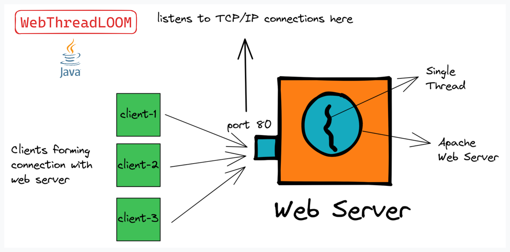
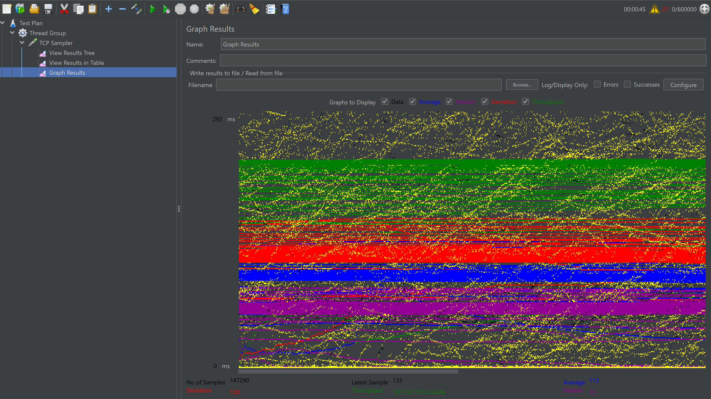
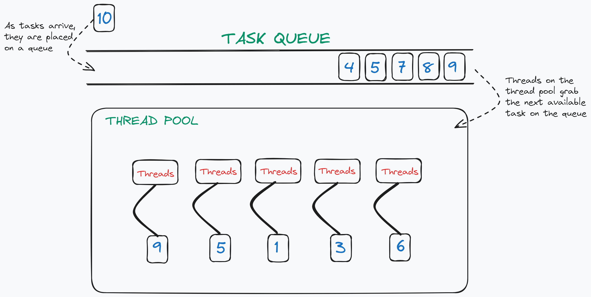
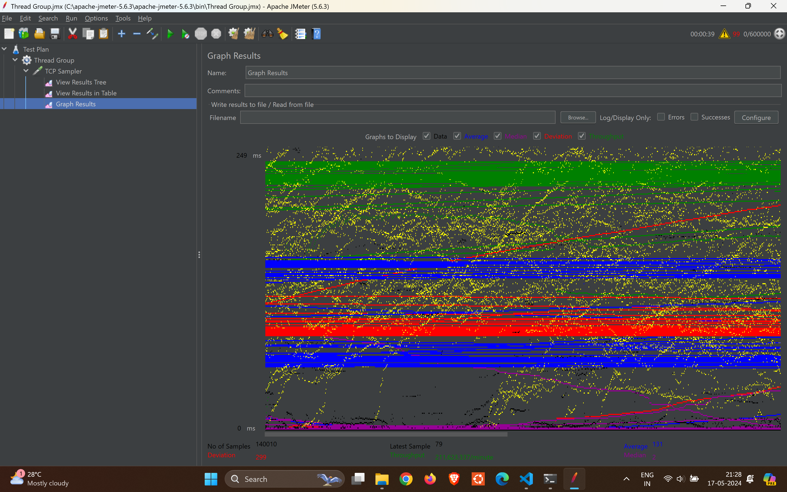

<center>

# WebThreadLoom🧵 (Made using JAVA)



**This repository contains implementations of Java web servers using different concurrency models: Single Threaded, Multithreaded, and ThreadPool. The web servers are implemented using Java's `ServerSocket` and `Socket` classes to handle client requests. The web servers are tested using JMeter to measure their performance under different loads.**

> 💡 **Note:** Each web server implementation in this repository has been rigorously tested by spawning 600,000 requests. This extensive load testing demonstrates the robustness and efficiency of each model under heavy traffic conditions.

</center>

## SingleThreaded Web Server
### Description

This is a simple web server implementation that handles one client at a time. It uses a single thread to handle each client request.

### Cons:

- The server can become unresponsive if the number of client requests exceeds the number of available threads.
- The server creates a new thread for each client request, which can lead to high memory usage.
- Multithreaded Web Server can be more efficient than SingleThreaded Web Server if the number of client requests is large.

### Performance:

- You can use JMeter to test the performance of the SingleThreaded server. Here's a graph showing the results:

<center>

</center>


## Multithreaded Web Server
### Description 

This web server implementation handles multiple clients concurrently using threads. Each client request is handled by a separate thread. The server creates a new thread for each client request and assigns the request to the thread. 

### Cons :

- The server creates a new thread for each client request, which can lead to high memory usage.
- The server can become unresponsive if the number of client requests exceeds the number of available threads.
- Thread Pool solves the problem of thread creation and thread termination.

### Performance:

- You can use JMeter to test the performance of the Multithreaded server. Here's a graph showing the results:
<center>

</center>


## ThreadPool Web Server

<center>

</center>

### Description

This web server implementation utilizes a fixed-size thread pool to handle client requests. The thread pool is created with a specified number of threads, and each client request is assigned to an available thread in the pool.

### Performance:

- You can use JMeter to test the performance of the ThreadPool server. Here's a graph showing the results:

<center>

</center>


## How to Run the Web Servers

### SingleThreaded, Multithreaded, and ThreadPool Web Server

```bash
javac Server.java
```

```bash
java Client.java
```

```bash
java Server
```
```bash
java Client
```

## Conclusion

- This repository contains implementations of Java web servers using different concurrency models: Single Threaded, Multithreaded, and ThreadPool.
- The web servers are implemented using Java's `ServerSocket` and `Socket` classes to handle client requests.
- The web servers are tested using JMeter to measure their performance under different loads.
- The SingleThreaded, Multithreaded, and ThreadPool web servers are compared based on their performance and efficiency under heavy traffic conditions.
- The ThreadPool web server is the most efficient and scalable solution for handling client requests under heavy traffic conditions.


